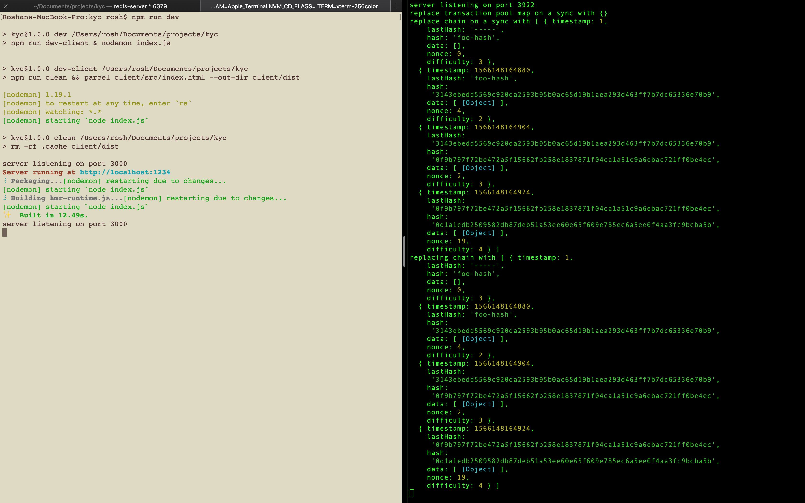
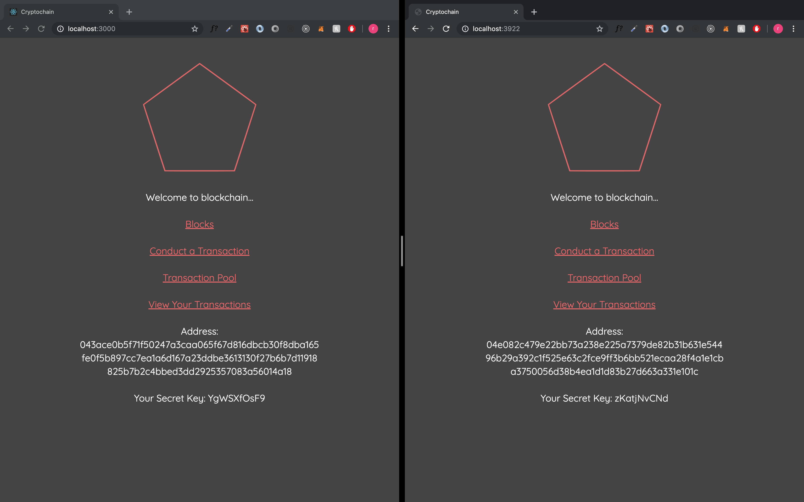
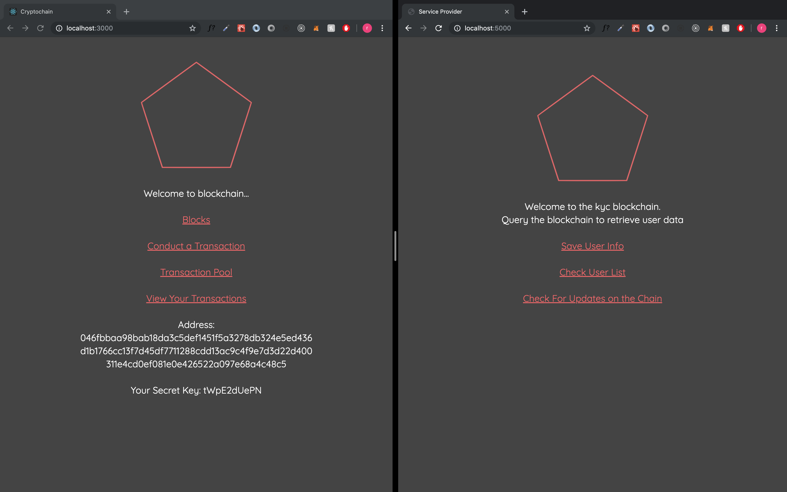

# Customer Info Chain

A blockchain system that stores encrypted user identity data. It is used by users to share their identity information with their trusted service providers

A service provider can query the blockchain to get user's latest information using his wallet publicKey.

---

## Redis Installation

Please ensure redis is installed locally as the system utilizes Redis for providing Pub/Sub capability

```bash
# Follow the instructions for installation
https://redis.io/topics/quickstart
```

---

## Quick Start

```bash
# Install Dependencies
npm install

# run redis server
redis-server
```

Now for demo purposes, we shall run the system in 2 procedures.

### System being used by users

The first procedure will run the system from a user perspective. No service provider involved in this step

Open up two terminals to signify two separate nodes in the network. Ensure that redis-server is running in background

```bash
# First terminal
npm run dev

# Second terminal
npm run dev-peer
```

Ensure that dev-peer command is ran after successful completion of the first command



Open up 2 browser windows, one with **localhost:3000** and the other with **localhost:{PORT}** the PORT is defined in your dev-peer terminal window.



Conduct a transaction in one window and see the transaction pool updating in the other.

For a demo, please check the video titled **user-interaction.mov**

---

### System with service provider

This is the second procedure involving a service provider and how he can access a user's information

Open up two terminals to signify two separate nodes in the network. Ensure that redis-server is running in background

```bash
# First terminal
npm run dev

# Second terminal
npm run service-provider
```

Open up 2 browser windows, one with **localhost:3000** and the other with **localhost:5000**.



For a demo, please check the video titled **service-provider-interaction.mov**

---

## Main Technologies

### Client Side

- [x] **[React](https://github.com/facebook/react)**
- [x] **[React Bootstrap](https://react-bootstrap.github.io/)**
- [x] **[React-Router-DOM](https://github.com/ReactTraining/react-router/tree/master/packages/react-router-dom)**

### Server Side

- [x] **[Node.js / Express](https://github.com/expressjs/express)**
- [x] **[Redis](https://redis.io/topics/quickstart)**

#### Libraries used in Server-side

- [x] **[elliptic](https://www.npmjs.com/package/elliptic)**
- [x] **[cryptr](https://www.npmjs.com/package/cryptr)**
- [x] **[hex-to-binary](https://www.npmjs.com/package/hex-to-binary)**
- [x] **[crypto](https://nodejs.org/api/crypto.html#crypto_class_hash)**
